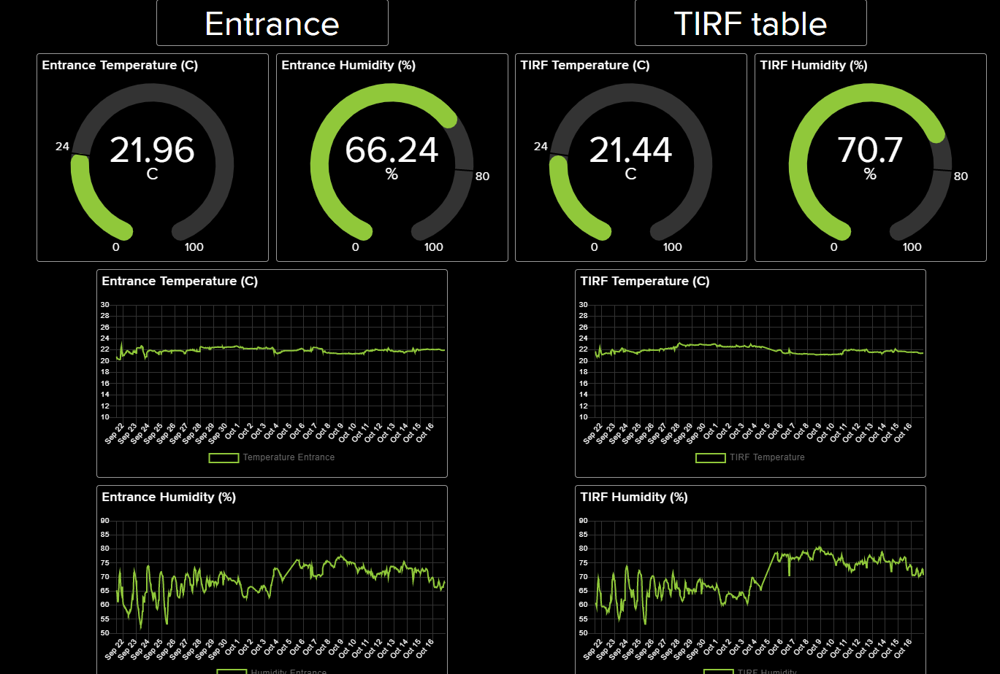
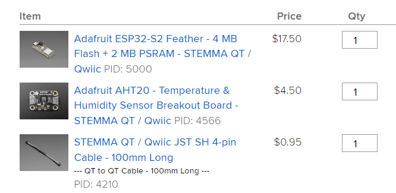
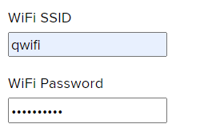
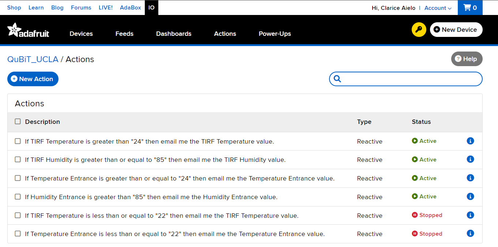
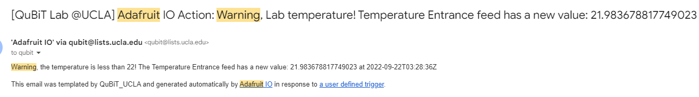

This is a small project I did as a postdoc at UCLA QuBiT lab.

Here I describe how to set up a humidity-temperature sensor that displays and plots the data online and sends an email alert when the values excede a certain range.  You can make it so anyone with a link can see the data, which, for two sensors, looks something like this:

We use a controller and a sensor from adafruit, and a free adafruit account is required.

The setup follows a [no-code](https://vas3k.com/blog/nocode/) approach, so no programming is needed.

# Parts

We are using a sensor driven by a microcontroller with an integrated wifi module.

Here is the [list of parts](http://www.adafruit.com/wishlists/555475). Note that the board needs to be powered via USB-C cable (not included in the list but is available on the webpage). Depending on the availability, different models of the board and the sensor might be used, e.g., we had to use a bit pricier [Si7021](https://www.adafruit.com/product/3251) because the other sensor was not available. Check supported devices at [https://io.adafruit.com/wippersnapper](https://io.adafruit.com/wippersnapper) (you should be loged in with your adafruit account).
.

---

**Note that the microcontroller board from the list requires a wifi network at 2.4 GHz to operate!**

## Setup

Follow [this link](https://learn.adafruit.com/no-code-humidity-and-temp-tracker) , but choose the board and sensor models that you’re using.

To activate WipperSnapper (it is online and is not installed locally), follow [this link](https://learn.adafruit.com/quickstart-adafruit-io-wippersnapper) . 

When it asks to generate a json file, use the parameters of your WIFI (it has to be @ 2.4 GHz) 

# Email alerts

Email alerts can be set up on the “Actions” page. Everything is straightforward. 

For a free account, only a single email can receive alerts. So we set it up so the alert is sent to the lab email, from where it is forwarded to all lab members. The email looks like this:

# Upgrades

The setup allows connecting additional sensors. I would also add a water sensor to detect floods or leakage.
